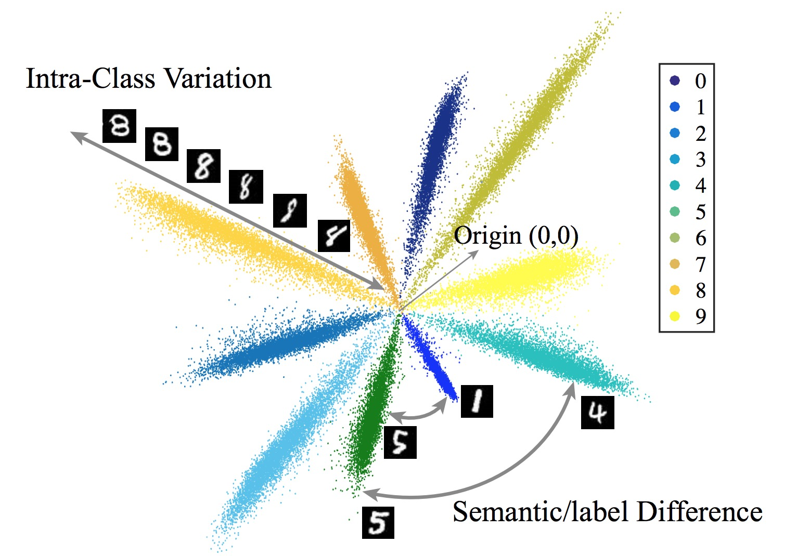

# Decoupled Networks

By Weiyang Liu*, Zhen Liu*, Zhiding Yu, Bo Dai, Rongmei Lin, Yisen Wang, James Rehg, Le Song (* equal contribution)

### License

Decoupled Networks is released under the MIT License (refer to the LICENSE file for details).

### Updates
- [x] Examples for ImageNet-2012 </li>
- [x] Examples for CIFAR-100 </li>

### Contents
0. [Introduction](#introduction)
0. [Short Video Introduction](#short-video-introduction)
0. [Citation](#citation)
0. [Requirements](#requirements)
0. [Usage](#usage)


### Introduction

Inner product-based convolution has been a central component of convolutional neural networks (CNNs) and the key to learning visual representations. Inspired by the observation that CNN-learned features are naturally decoupled with the norm of features corresponding to the intra-class variation and the angle corresponding to the semantic difference, we propose a generic decoupled learning framework which models the intra-class variation and semantic difference independently. Specifically, we first reparametrize the inner product to a decoupled form and then generalize it to the decoupled convolution operator which serves as the building block of our decoupled networks. We present several effective instances of the decoupled convolution operator. Each decoupled operator is well motivated and has an intuitive geometric interpretation. Based on these decoupled operators, we further propose to directly learn the operator from data. Extensive experiments show that such decoupled reparameterization renders significant performance gain with easier convergence and stronger robustness. The latest version of our paper is available at [arXiv](https://arxiv.org/abs/1804.08071) and [here](http://wyliu.com/papers/LiuCVPR18_DCNets.pdf).

Our work is largely inspired and motivated by the observation that the CNN-learned features are naturally decoupled, as shown as follows.



As illustrated as follows, the central idea of decoupled networks is the *decoupled convolution*, which is used to replace all the original convolution operators.


### Short Video Introduction

The following is a short video introduction by [Zhen Liu](http://itszhen.com/).

[](https://www.youtube.com/watch?v=ZnYb0UBIPj0)

### Citation

If you find our work useful in your research, please consider to cite:

    @InProceedings{Liu_2018_CVPR,
        author = {Liu, Weiyang and Liu, Zhen and Yu, Zhiding and Dai, Bo and Lin, Rongmei and Wang, Yisen and Rehg, James M. and Song, Le},
        title = {Decoupled Networks},
        booktitle = {The IEEE Conference on Computer Vision and Pattern Recognition (CVPR)},
        year = {2018}
    }


### Requirements
1. `Python 2.7`
2. `TensorFlow` (Tested on version 1.01)
3. `numpy`


### Usage

#### Part 1: Clone the repositary
  - Clone the repositary.

	```Shell
	git clone https://github.com/wy1iu/SphereNet.git
	```

#### Part 2: CIFAR-100

	```Shell
	cd $SPHERENET_ROOT/dcnet_cifar100/tanh_cos
	python train_resnet.py
	```

#### Part 3: ImageNet-2012

  - Download [ImageNet-2012](http://www.image-net.org/) dataset and process the dataset with [TensorFlow-Slim](https://github.com/tensorflow/models/tree/master/research/slim#an-automated-script-for-processing-imagenet-data).

  - We provide one example for ImageNet-2012. We use TanhConv magnitude function + Cosine angular activation in this implementation. The user can replace magnitude function and angular function with the other choices mentioned in the paper or any other customized functions.

	```Shell
	cd $SPHERENET_ROOT/dcnet_imagenet
	python train_DCnet.py
	```

  - We provide [the result](https://github.com/wy1iu/DCNets/blob/master/dcnet_imagenet/results/training_log) for this implementation, which matches our reported result 88.9% in the paper.

